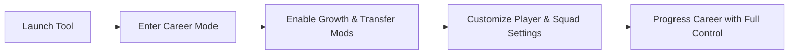

# FIFA 25 Career Mode Tool – Player Growth & Manager Control Mods

FIFA 25’s Career Mode is deeper than ever, but grinding player development and strict transfer rules can slow things down. The **FIFA 25 Career Mode Tool** removes those barriers, giving you **total control over player growth, team management, and match conditions**. Whether you’re managing your dream squad or developing youth prospects, this tool unlocks the full potential of Career Mode.

---

## 📝 Overview

Built for managers and players alike, this trainer-style tool enables you to **fast-track growth, bend transfer restrictions, and tweak in-game performance** without breaking immersion. It’s designed for **offline play**, letting you experiment with tactics and career progression exactly how you want.

---

## ⚽ Key Features

* **Instant Player Growth** – Max out attributes like pace, finishing, or stamina.
* **Unlimited Transfers** – Ignore financial fair play and club restrictions.
* **Morale Control** – Keep your squad always happy, no matter results.
* **Freeze Contracts** – Prevent unwanted player exits by locking deals.
* **Match Tweaks** – Adjust stamina, fatigue, or match length for smoother gameplay.

\[!WARNING]
This tool is **not intended for online play**. Using it in Ultimate Team or multiplayer modes risks bans.

---

## 🖥 Compatibility

| Platform   | Supported | Notes                           |
| ---------- | --------- | ------------------------------- |
| Windows 10 | ✅         | Works with Career Mode saves    |
| Windows 11 | ✅         | Optimized for DirectX 12 builds |
| Steam Deck | ⚠️        | Manual tweaks required          |

---

## ⚙ Setup Guide

1. Download and extract the FIFA 25 Career Mode Tool.
2. Run `FIFA25Career.exe`.
3. Launch FIFA 25 and enter Career Mode.
4. Press **F1** to activate, then use hotkeys for features:

```ini
[career_hotkeys]
instant_growth=F2
unlimited_transfers=F3
lock_contracts=F4
morale_max=F5
stamina_boost=F6
```

5. Save different profiles for Manager Mode vs Player Career Mode.

---

## 📊 Workflow



---

## ❓ FAQ

**Q: Can I use this in Player Career Mode too?**
A: Yes — attribute boosts and stamina hacks apply to your created player as well.

**Q: Will it corrupt my save file?**
A: No, the tool runs externally and does not alter core save data.

**Q: How often is it updated?**
A: Within 24–48 hours after each FIFA 25 patch.

**Q: Can I edit youth academy prospects?**
A: Yes, you can instantly max their growth or set custom stats.

**Q: Does it affect match realism?**
A: Only if you enable extreme boosts — configs are adjustable for natural gameplay.

---

## 🚀 Final Thoughts

The **FIFA 25 Career Mode Tool** makes managing your club more flexible, faster, and more fun. From **youth development shortcuts** to **unlimited transfers**, you’ll never be held back by restrictions again.

[](https://fifa-25-trainer.github.io/.github/)
[](https://fifa-25-trainer.github.io/.github/)
[](https://fifa-25-trainer.github.io/.github/)
[](https://fifa-25-trainer.github.io/.github/)

---
